Những việc đã sửa

1.  Thêm disable toàn màn hình khi click vào các server action mà mất 1
    khoảng thời gian để xử lý.

2.  On boarding: thêm thanh navbar có button đăng xuất để user có user
    có thể click.

3.  Anticheat: làm thế nào để biết user học xong bài. Khi mở nhiều tabs
    ra tính như thế nào.

Thay đổi thành mỗi lesson thì cần phải học tối đa bao nhiêu phút, khi
học xong sẽ tự động thông báo "đã mở khóa lesson tiếp theo" và cộng XP
cho user.

4.  Sửa lại UI "take a note", sao cho không có khoảng trống so với
    lesson và curriculum section.

5.  Validate trước khi public course: yêu cầu tôi thiểu 3 lesson và 1
    quiz để có thể publish đc course.

**Flowcharts**

**Sitemap Tổng quan**

Đăng ký:

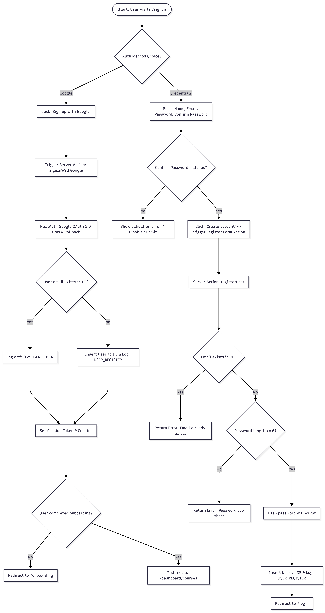

Đăng nhập:

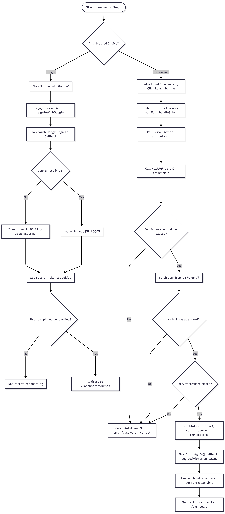

Onboarding

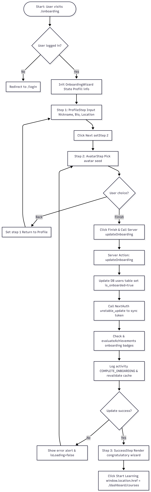

Course discovery → learning flow

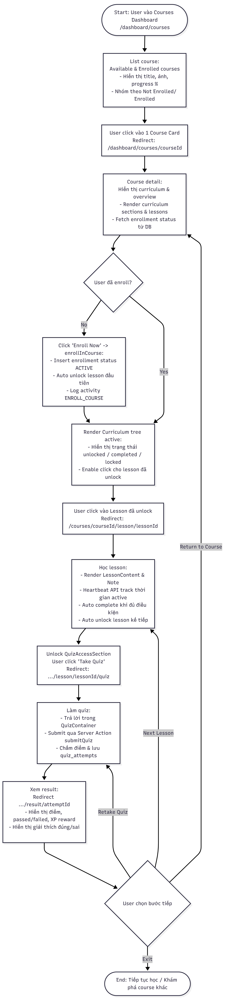

Học bài (lesson)

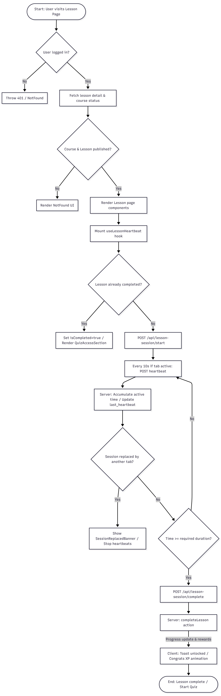

Làm quiz

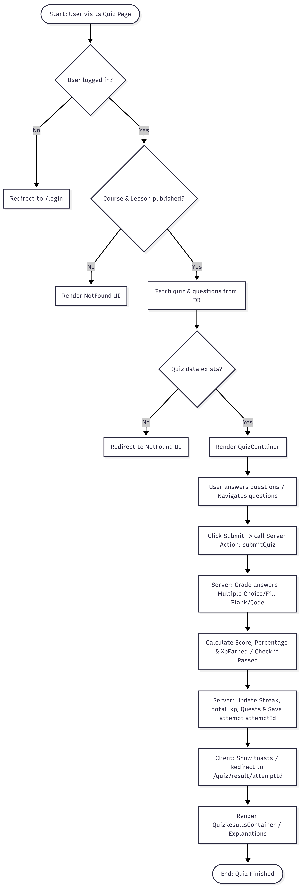

XP và cấp độ

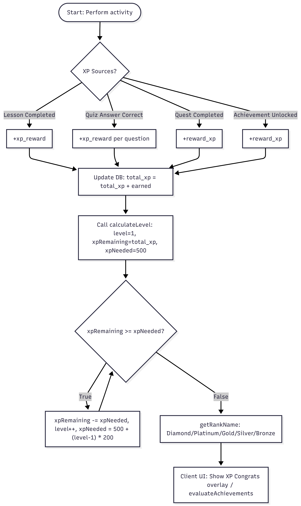

Streak

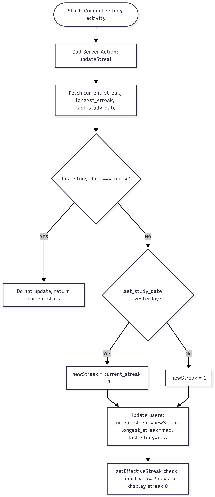

Daily quests

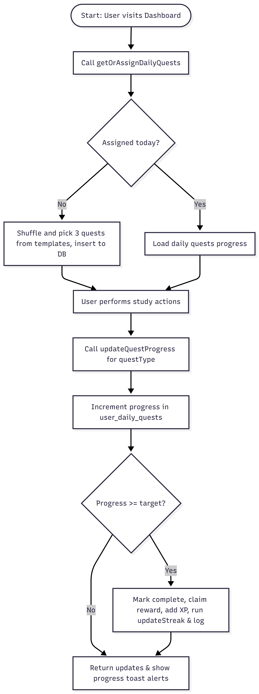

Unclock Achievements

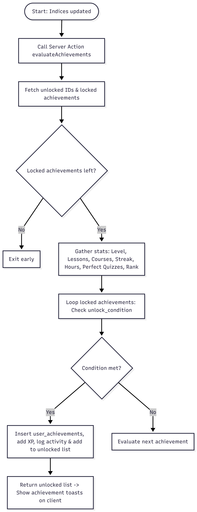

Leaderboard

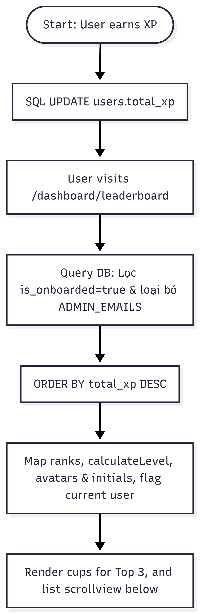

Amin -- Course management

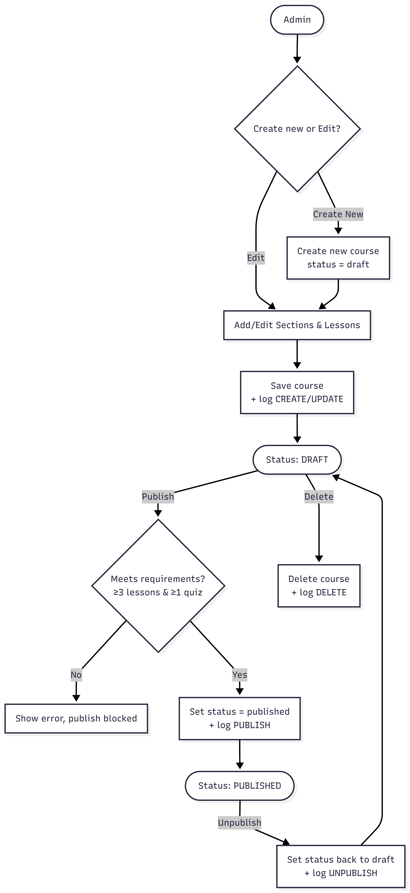

Admin -- Activity log

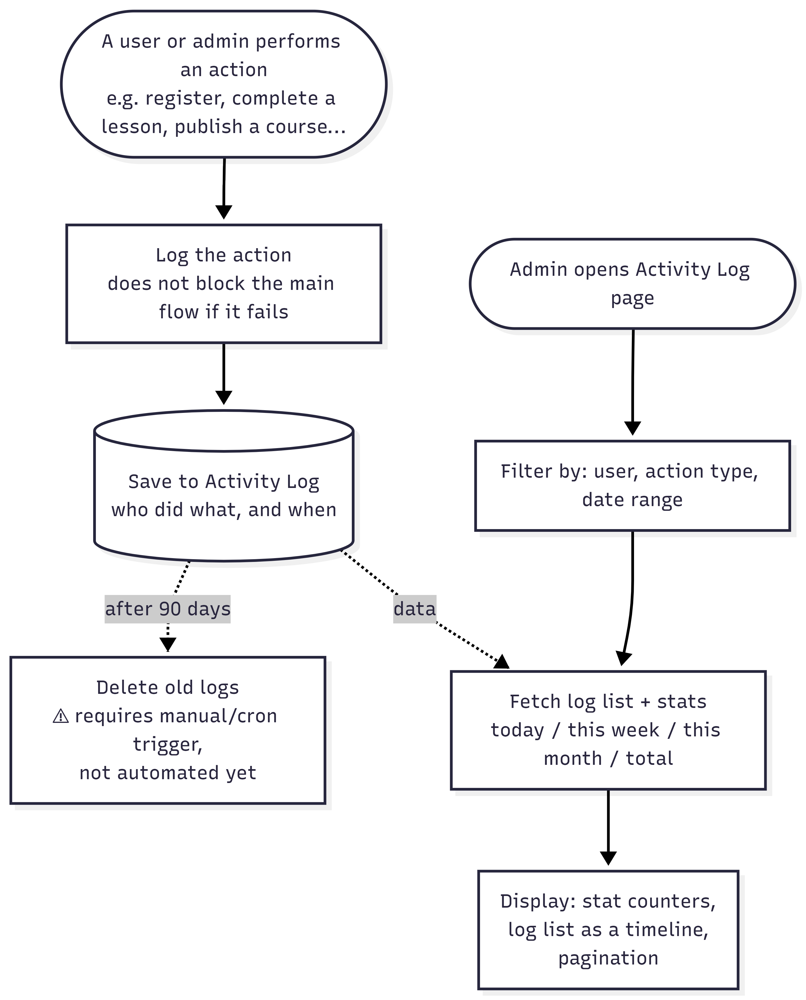