**Flowcharts**

**Sitemap Tổng quan**

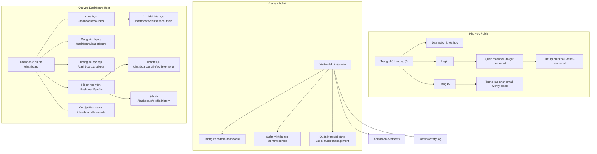

Đăng ký:

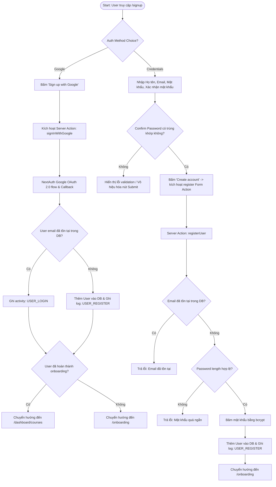

Đăng nhập:

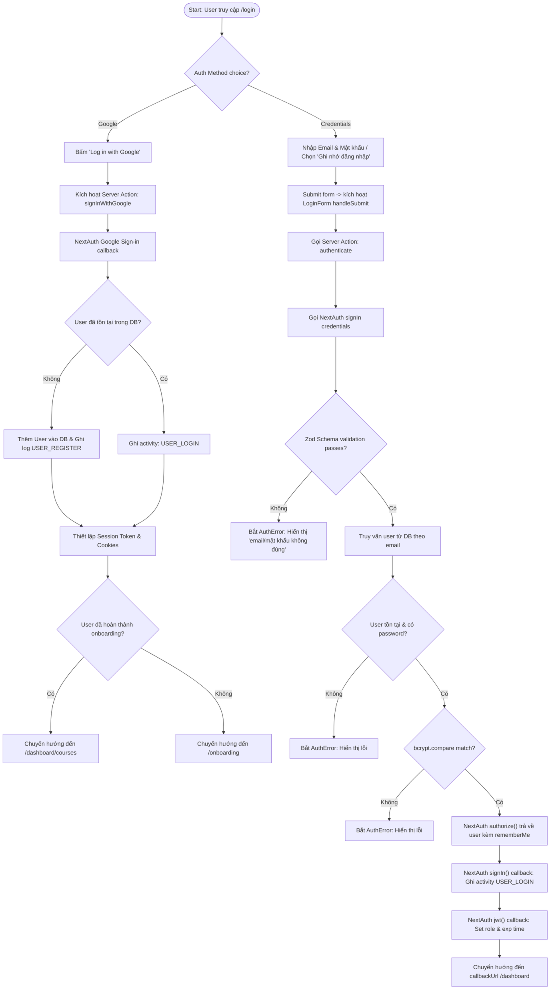

Onboarding

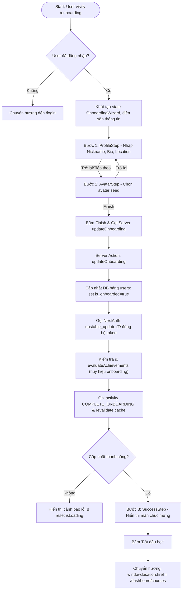

Course discovery → learning flow

```mermaid
flowchart TD
    Start([Start: User truy cập Courses Dashboard /dashboard/courses]) --> ListCourses["Danh sách khóa học: chưa đăng ký & đã đăng ký - hiển thị title, ảnh, tiến độ"]
    ListCourses --> ClickCard["User bấm vào Course Card"]
    ClickCard --> RedirectDetail["Chuyển hướng: /dashboard/courses/:courseId"]
    RedirectDetail --> CourseDetail["Chi tiết khóa học: hiển thị curriculum - render sections & lessons"]
    CourseDetail --> FetchEnroll["Truy vấn trạng thái đăng ký"]
    FetchEnroll --> EnrollCheck{"Đã enroll chưa?"}

    EnrollCheck -->|Chưa| ClickEnroll["Bấm 'Enroll Now' -> gọi enrollInCourse"]
    ClickEnroll --> InsertEnroll["Thêm enrollment status ACTIVE - Tự động mở khóa lesson đầu tiên - Ghi activity ENROLL_COURSE"]
    InsertEnroll --> RenderTree

    EnrollCheck -->|Rồi| RenderTree["Hiển thị cây Curriculum - trạng thái unlocked/completed/locked - Cho phép bấm vào lesson đã mở khóa"]

    RenderTree --> ClickLesson["User bấm vào Lesson đã mở khóa"]
    ClickLesson --> RedirectLesson["Chuyển hướng: /courses/:courseId/lesson/:lessonId"]
    RedirectLesson --> LearnLesson["Học lesson: Render LessonContent & Note - Heartbeat API theo dõi thời gian active - Tự động hoàn thành khi đủ điều kiện - Tự động mở khóa lesson kế tiếp"]
    LearnLesson --> UnlockQuiz["Mở QuizAccessSection / User bấm 'Take quiz'"]
    UnlockQuiz --> RedirectQuiz["Chuyển hướng: /lesson/:lessonId/quiz"]
    RedirectQuiz --> DoQuiz["Làm quiz: Trả lời trong QuizContainer - Submit qua Server Action submitQuiz - chấm điểm & lưu quiz_attempts"]
    DoQuiz --> ViewResult["Xem kết quả -> Chuyển hướng /result/:attemptId - Hiển thị điểm, passed/failed, XP thưởng - Hiển thị giải thích đúng/sai"]
    ViewResult --> NextChoice{"User chọn bước tiếp"}
    NextChoice -->|Next Lesson| RenderTree
    NextChoice -->|Làm lại Quiz| DoQuiz
    NextChoice -->|Exit| ReturnCourse["Quay lại trang Course"]
    ReturnCourse --> End([End: Tiếp tục học / Kết thúc course lần này])
```

Học bài (lesson)

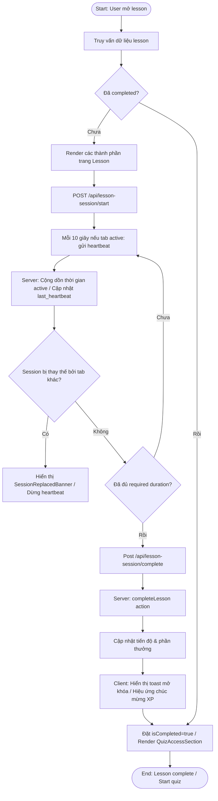

Làm quiz

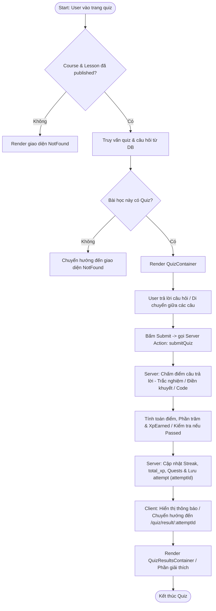

XP và cấp độ

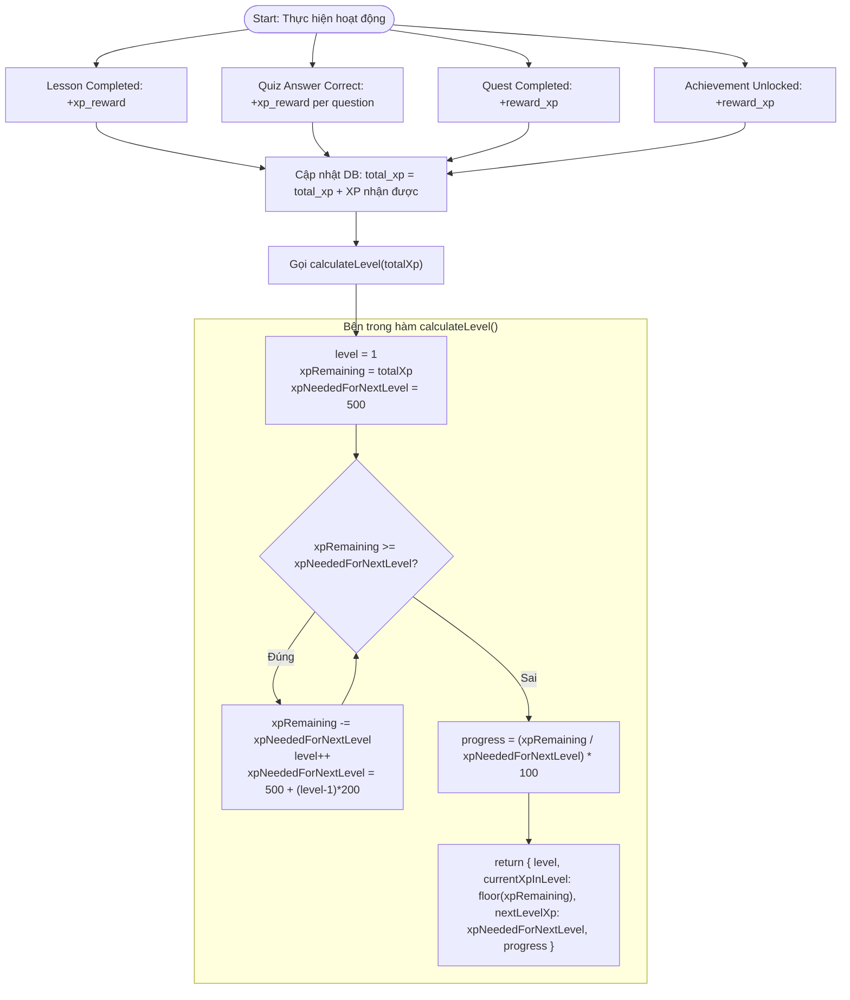

Streak

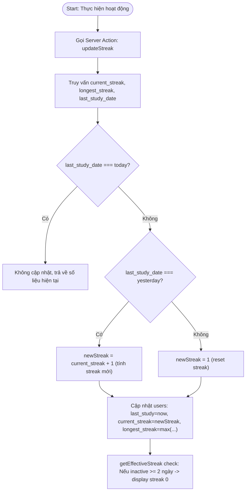

Daily quests

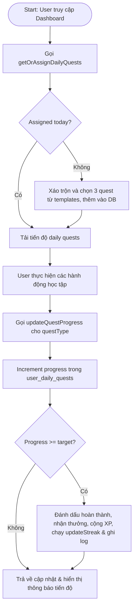

Unlock Achievements

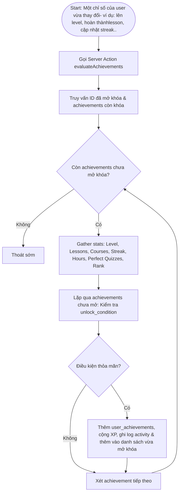

Leaderboard

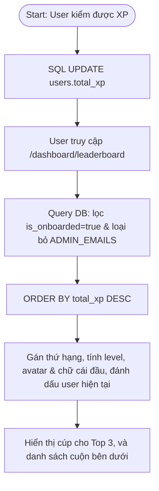

Admin — Course management

```mermaid
flowchart TD
    Start([Start: Admin quản lý khóa học]) --> Choice{"Create New hay Edit?"}
    Choice -->|Create New| CreateNew["Tạo khóa học mới, nhập đầy đủ thông tin (Tên, Mô tả, Category, Level), "Save Course" status = draft"]
    Choice -->|Edit| LoadCourse["Tải khóa học hiện có (mọi status)"]
    CreateNew --> EditSections["Thêm/Sửa Sections & Lessons"]
    LoadCourse --> EditSections
    EditSections --> SaveCourse["Lưu khóa học + ghi log CREATE/UPDATE"]

    SaveCourse --> Draft["Status: DRAFT (bản nháp)"]
    Draft --> PublishClick["Xuất bản (Publish)"]
    PublishClick --> MeetsReq{"Đủ điều kiện? (>=3 lesson & >=1 quiz)"}
    MeetsReq -->|Không| ErrorBlock["Hiển thị lỗi, chặn xuất bản"]
    MeetsReq -->|Có| SetPublished["Đặt status = published + log PUBLISH"]

    SetPublished --> Published["Status: PUBLISHED (đã xuất bản)"]
    Published --> UnpublishClick["Gỡ xuất bản (Unpublish)"]
    UnpublishClick --> SetDraft["Đặt status về draft + log UNPUBLISH"]
    SetDraft --> Draft

    Draft --> DeleteClick["Xóa khóa học?"]
    Published --> DeleteClick
    DeleteClick -->|Có| DeleteCourse["Xóa khóa học + ghi log DELETE"]
```

Admin — Activity log

```mermaid
flowchart TD
    subgraph LOGGING["Ghi log"]
        Start1([Một user hoặc admin thực hiện một hành động- e.g. register, complete a lesson, publish a course...]) --> LogAction["Log the action - không block main flow nếu fail"]
        LogAction --> SaveLog["Lưu vào Activity Log - Ai đã làm gì? Và khi nào?"]
        SaveLog --> After90["Sau 90 ngày"]
        After90 --> DeleteOld["Xóa log cũ - yêu cầu trigger thủ công/cron, chưa tự động"]
    end

    subgraph VIEWING["Xem log"]
        Start2([Admin mở trang Activity Log]) --> Filter["Lọc theo: user, loại hành động, khoảng thời gian"]
        Filter --> FetchLogs["Truy vấn danh sách log + thống kê: hôm nay / tuần này / tháng này / tổng"]
        FetchLogs --> Display["Display: stat counters, log list dạng timeline, pagination"]
    end
```
